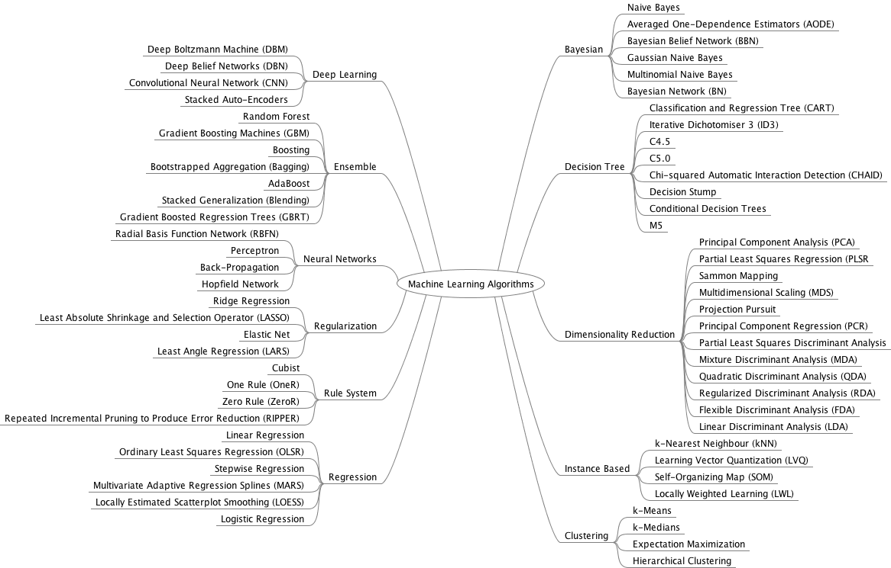

# Machine Learning Algorithms

In this repository I am sharing my survey on various **Machine Learning(ML) Algorithms** and **statistical models** and their use cases.

###                                         Classification of ML algorithms

 <table>
  <tr>
    <th colspan="3">REGRESSION </th>
  </tr>
  <tr>
    <td>Name of the Method</td>
    <td>Purpose</td>
    <td>Code</td>
  </tr>
  <tr>
    <td>Ordinary Least Squares Regresion (OLSR)</td>
    <td></td>
    <td>here</td>
  </tr>
  <tr>
    <td>Linear Regression</td>
    <td>regression</td>
    <td><a href="https://github.com/abhinabasaha/Machine_Learning_Algorithms/tree/master/Regression/Linear_Regression">here</td>
  </tr>
  <tr>
    <td>Logistic Regression</td>
    <td>binary classification</td>
    <td><a href="https://github.com/abhinabasaha/Machine_Learning_Algorithms/tree/master/Regression/Logistic_Regression">here</td>
  </tr>
  <tr>
    <td>Stepwise Regression</td>
    <td></td>
    <td>here</td>
  </tr>
  <tr>
    <td>Multivariate Adaptive Regression Splines (MARS)</td>
    <td></td>
    <td>here</td>
  </tr>
  <tr>
    <td>Locally Estimated Scatterplot Smoothing (LOESS)</td>
    <td></td>
    <td>here</td>
  </tr>
  <tr>
    <td>Jackknife Regression</td>
    <td></td>
    <td>here</td>
  </tr>
</table>

<table>
<thead>
  <tr>
    <th colspan="2">Classification </th>
  </tr>
</thead>
<tbody>
  <tr>
    <td>Name of the Method</td>
    <td>Code</td>
  </tr>
  <tr>
    <td>SVM</td>
    <td>here</td>
  </tr>
  <tr>
    <td>KNN</td>
    <td>here</td>
  </tr>
  <tr>
    <td>Random Forest</td>
    <td>here</td>
  </tr>
  <tr>
    <td>XGBoost (with and without GPU Support)</td>
    <td><a href="https://github.com/abhinabasaha/Machine_Learning_Algorithms/blob/master/Ensemble%20Learning/XG_boost/XG_boost.ipynb">here</a></td>
  </tr>
</tbody>
</table>
